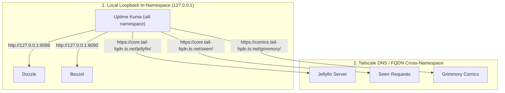

# Uptime Monitoring & Notifications with Uptime Kuma

Welcome to your self-hosted uptime and performance command center! **Uptime Kuma** is a beautiful, modern, and lightweight service monitor that keeps a constant pulse on your entire Net-Stream stack.

This guide will walk you through setting up Uptime Kuma, understanding how it routes traffic across your isolated Docker namespaces, configuring your first set of monitors, and connecting instant notifications (like Telegram, Discord, or Push alerts).

---

## How Uptime Kuma Fits Your Network Architecture

Because Net-Stream uses the **Nested Gateway Pattern**, applications are divided into isolated network namespaces (`core`, `addons`, `stremio-util`, `comics`, `util`, etc.). Uptime Kuma resides in the **`util` (Utilities)** namespace sharing the stack with `utilities-gateway-gluetun`.

This layout gives Uptime Kuma two distinct ways of reaching and monitoring your services:



1.  **Local Loopback (Zero Network Overhead):** Uptime Kuma can directly reach services inside the `util` shared namespace using `http://127.0.0.1:<port>`. It does not need to go through the tailnet or internet for these.
2.  **Tailscale MagicDNS (Secure Cross-Namespace):** To monitor isolated services in other gateways (like Jellyfin in `core` or Grimmory in `comics`), Uptime Kuma makes HTTPS requests to their Tailscale FQDNs. These requests safely route across your secure local tailnet.

---

## Initial Login & Setup

1.  Open Uptime Kuma in your web browser using your tailnet utility link:
    ```
    https://util.<your-tailnet-subdomain>.ts.net/uptime-kuma/
    ```
2.  On first load, Uptime Kuma will prompt you to create an **Administrator Account**.
3.  Enter a strong username and password, then click **Create**. You're now inside the dashboard!

---

## 1. Configuring Your First Monitors

Let's set up a diverse set of monitors to track every aspect of your server's health. Click **Add New Monitor** in the top left of the dashboard for each of these:

### A. Local Service Monitors (Fastest & Simplest)
These check utility services running in the same gateway network namespace using `localhost`.

| Service Name | Monitor Type | URL | Heartbeat Interval | Retries |
| :--- | :--- | :--- | :--- | :--- |
| **Dozzle Log Viewer** | `HTTP(s)` | `http://127.0.0.1:8086` | `60 seconds` | `2` |
| **Beszel Hub** | `HTTP(s)` | `http://127.0.0.1:8090` | `60 seconds` | `2` |

FreshRSS is **not** a local-loopback monitor here. Its compose project binds
`127.0.0.1:8020` on the VPS host, while Uptime Kuma runs in the utility
Gluetun namespace. That container cannot use `127.0.0.1` to reach the host.
Monitor FreshRSS from a host-level monitoring agent, or first provide an
intentional Caddy/Tailscale route and monitor that route.

> [!TIP]
> **Why 127.0.0.1?** Inside a shared container namespace, all services share the network interface. Local monitoring consumes virtually 0 CPU and network bandwidth and stays completely offline.

---

### B. Core Media Monitors (Cross-Namespace)
These monitor services in other namespaces (like the `core` gateway) via your private Tailnet HTTPS endpoints.

| Service Name | Monitor Type | URL | Accepted Status Codes |
| :--- | :--- | :--- | :--- |
| **Jellyfin Server** | `HTTP(s)` | `https://core.<your-tailnet-fqdn>.ts.net/jellyfin/` | `200-299, 300-308` |
| **Seerr Requests** | `HTTP(s)` | `https://core.<your-tailnet-fqdn>.ts.net/seerr/` | `200-299` |
| **Grimmory Comics** | `HTTP(s)` | `https://comics.<your-tailnet-fqdn>.ts.net/grimmory/` | `200-299` |

> [!NOTE]
> Tailscale HTTPS endpoints terminate TLS certificates automatically, meaning Uptime Kuma can securely verify both service health and SSL certificate validity!

---

### C. VPN Gateway Outbound & IP Health (Advanced)
Since Uptime Kuma routes its outbound internet traffic through a WireGuard VPN tunnel inside Gluetun, you can monitor your VPN tunnel's active state and check if it has leaked your home/VPS real IP!

1.  **Create a New Monitor**
2.  **Monitor Type:** `HTTP(s) - Keyword`
3.  **URL:** `https://ipinfo.io/json`
4.  **Heartbeat Interval:** `120 seconds`
5.  **Keyword:** *[Your VPN Provider Name]* (e.g., `Mullvad`, `NordVPN`, `ProtonVPN`, or `Surfshark`).
6.  **Invert Keyword:** Set to **No**. (If Uptime Kuma accesses `ipinfo.io` and the JSON response does *not* contain your VPN provider's network name, it indicates the VPN has disconnected or leaked, triggering an instant alarm!)

---

### D. Real-Debrid API Health (Third-Party Integration)
To verify that Zurg and Comet have active connections to the Real-Debrid servers, you can track the official API latency:

1.  **Monitor Type:** `HTTP(s)`
2.  **URL:** `https://api.real-debrid.com/time` (or `https://api.real-debrid.com/rest/1.0/ping` with API token headers)
3.  **Heartbeat Interval:** `300 seconds` (keep third-party checks relaxed to avoid rate limits).

---

## 2. Setting Up Instant Notifications

Monitoring is only half the battle; Uptime Kuma shines at alerting you the millisecond a service degrades. Let's configure your favorite communication channel:

### Option A: Telegram Bot Alerts (Highly Recommended)
Telegram is extremely reliable, supports silent/loud notifications, and takes under 2 minutes to create:

1.  **Create a Bot:** Open Telegram and search for `@BotFather`. Send the command `/newbot`. Follow the prompts to name your bot and copy the **HTTP API Bot Token**.
2.  **Get Your Chat ID:** Search for `@userinfobot` in Telegram and start it. It will instantly reply with your numerical **ID**.
3.  **Configure Uptime Kuma:**
    *   In Uptime Kuma, go to **Settings** -> **Notifications** -> **Setup Notification**.
    *   **Notification Type:** `Telegram`
    *   **Bot Token:** Paste your Bot Token.
    *   **Chat ID:** Paste your personal User ID.
    *   Click **Test** to receive a test message, then **Save**.

---

### Option B: Discord Webhooks
If you use Discord for your community or server management, webhook integration is built-in:

1.  **Get Discord Webhook URL:** Open Discord, go to your server's **Channel Settings** -> **Integrations** -> **Webhooks** -> **Create Webhook**. Copy the Webhook URL.
2.  **Configure Uptime Kuma:**
    *   Go to **Settings** -> **Notifications** -> **Setup Notification**.
    *   **Notification Type:** `Discord`
    *   **Discord Webhook URL:** Paste the copied webhook URL.
    *   Click **Test** to watch a sleek embed card populate your channel, then **Save**.

---

### Option C: Gotify (Fully Self-Hosted & Private)
If you prefer a 100% private, self-hosted push notification server, you can pair Kuma with Gotify:

1.  **Configure Uptime Kuma:**
    *   **Notification Type:** `Gotify`
    *   **Gotify Application Token:** *[Create a new application in Gotify dashboard and copy token]*
    *   **Gotify Server URL:** `http://127.0.0.1:<gotify-port>` (if hosted in the same gateway) or your Tailscale URL.
    *   Click **Test**, then **Save**.

---

## 3. Organizing with Status Pages

Uptime Kuma allows you to compile your monitors into a stunning, public-facing or private **Status Page** to share with family or friends using your media servers:

1.  Click **Status Pages** in the top navigation bar.
2.  Click **New Status Page**.
3.  Give it a name (e.g., `Net-Stream Services`) and customize the URL slug (e.g., `status`).
4.  **Drag and drop** your active monitors into groups (e.g., "Media Services", "Stremio Addons", "Utility Tools").
5.  Add customized header descriptions, theme colors (dark mode by default!), and footer links.
6.  Hit **Save**. You now have a gorgeous, live-updating dashboard showing perfect green checkmarks!

---

## Maintenances & Customizations

*   **Pause Monitors for Updates:** Before running upgrades (e.g., executing `./manage.py redeploy` on the VPS host), go to Uptime Kuma and pause active checks or schedule a **Maintenance Window** in **Settings -> Maintenance** to prevent false down-alarms.
*   **Heartbeat Adjustments:** For local services (`127.0.0.1`), a heartbeat of `30 - 60 seconds` is perfect. For external APIs or Web domains, use `180 - 300 seconds` to respect rate limits.
