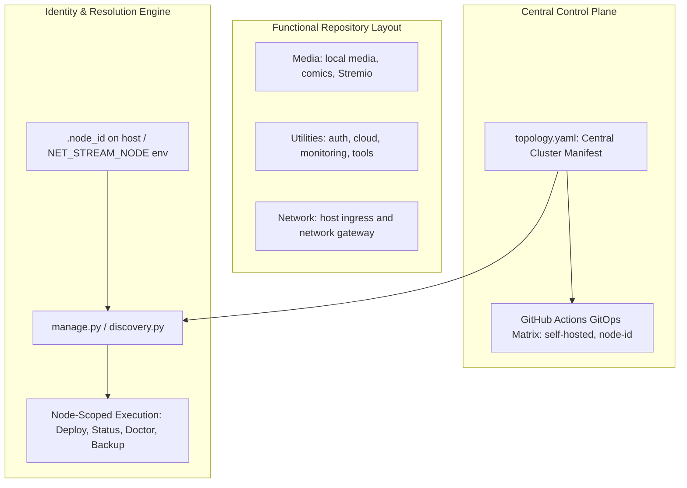
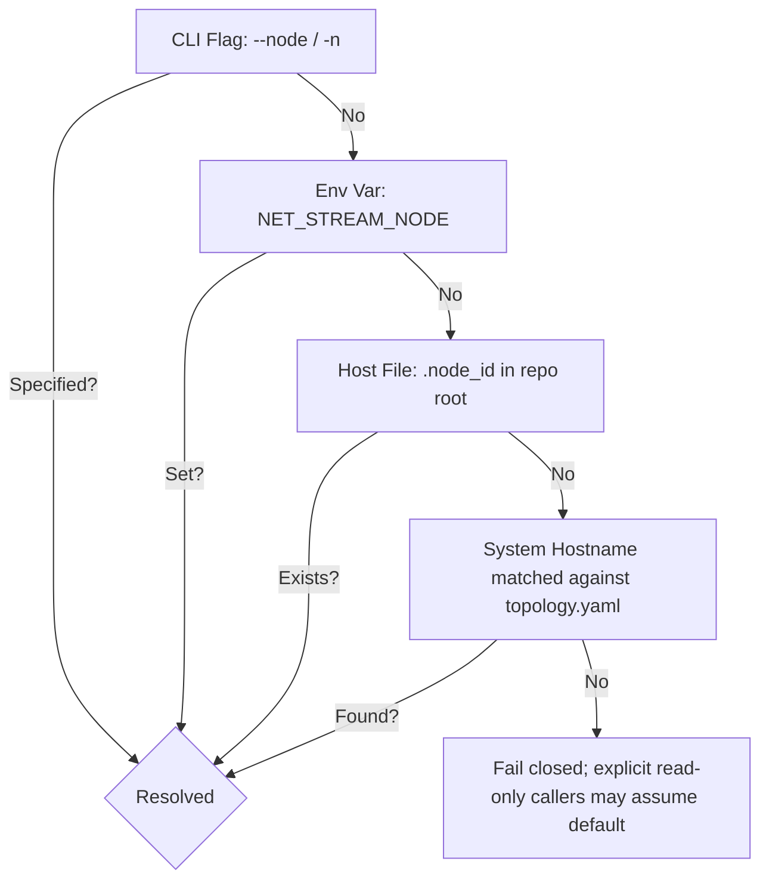
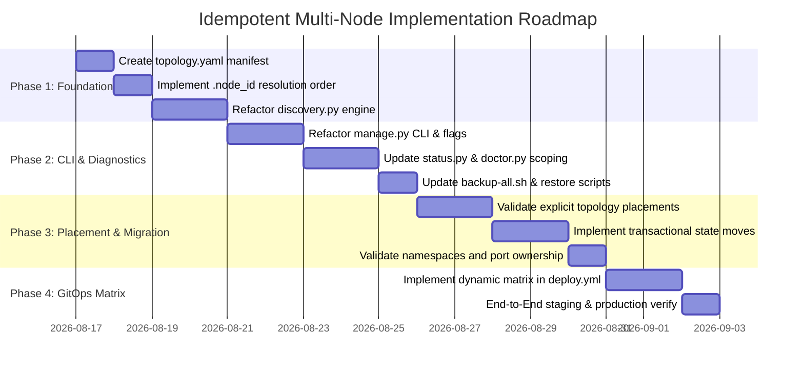

# Architecture Plan: Idempotent Multi-Node Cluster & Environment-ID Evolution

> **Status:** Proposed & Ready for Review  
> **Author:** Antigravity & Louis Bertrand Ntwali  
> **Date:** August 16, 2026  
> **Target:** Polaris Multi-Node Scalable Infrastructure  

---

## 1. Executive Summary & Vision

Polaris currently operates on a dual-VPS model (`VPS A` and `VPS B`). While functional, this binary classification introduces several architectural limitations:
* **Fragile Service Discovery:** `discovery.py` uses hardcoded path prefixes (`VPS_B_PREFIXES`) to determine service placement.
* **False Diagnostics & Status Probing:** Running `./manage.py status` on one machine attempts to probe services belonging to the other machine, marking them as `exited` or missing.
* **Scaling Bottleneck:** Adding a third machine (e.g. a dedicated GPU transcoding worker, a high-capacity NAS storage node, or an edge scraper) requires modifying CLI flags, Doppler project logic, backup scripts, and CI workflows in multiple places.

### The Objective
Transform Polaris into an **idempotent, N-node cluster architecture** where:
1. **Hosts are uniquely identified by an explicit Node ID** (e.g. `vps-a`, `vps-b`, `nas-storage`, `gpu-worker`).
2. **Cluster Topology is declared centrally in `topology.yaml`** for automated scripting, routing, and metadata.
3. **Repository structure remains organized by functional domain** (`Network/`,
   `Media/`, and `Utilities/`), while `topology.yaml` owns physical placement.
4. **Tooling and diagnostics are strictly scoped to the active Node by default**, with cluster-wide inspection available over the Tailscale/NetBird mesh network.
5. **GitOps CD dynamically matrices across active nodes** using standard GitHub runner labels (`[self-hosted, <node-id>]`).

---

## 2. Target Architecture Overview



---

## 3. Core Architectural Building Blocks

### A. Centralized Topology Manifest (`topology.yaml`)
A single declarative manifest at the repository root defines four contracts:
repository scan roots, nodes, real network namespaces, and path-to-node placements.
The namespace registry records both the Compose owner service and runtime container
name so validation can resolve the repository's existing `service:` and `container:`
network modes. The complete schema and authoritative example are defined in
[`1a-topology-manifest-spec.md`](./idempotent-multi-node/01-phase-1-foundation-and-identity/1a-topology-manifest-spec.md).

```yaml
version: "1.0"
cluster_name: "polaris"

repository:
  compose_roots: ["Network", "Media", "Utilities"]

nodes:
  vps-a:
    name: "Primary Ingress & Core Media Node"
    doppler_project: "polaris-vps-a"
    tags: [core, ingress, media, storage, auth]
    tailscale_fqdn: "vps-a.tailscale.ts.net"
    backup:
      tag: "vps-a"
      repository: "rclone:gdrive:backups/polaris/vps-a"

  vps-b:
    name: "Stremio Addons & Secondary Tools Node"
    doppler_project: "polaris-vps-b"
    tags: [stremio, scrapers, compute, ai]
    tailscale_fqdn: "vps-b.tailscale.ts.net"
    backup:
      tag: "vps-b"
      repository: "rclone:gdrive:backups/polaris/vps-b"

gateways:
  media-core:
    node: "vps-a"
    type: "gluetun"
    owner:
      path: "Media/local-media/gateway"
      service: "gluetun"
      container_name: "media-gateway-core-gluetun"
  stremio-addons-gateway:
    node: "vps-b"
    type: "gluetun"
    owner:
      path: "Media/stremio/addons/gateway"
      service: "gluetun"
      container_name: "media-gateway-stremio-addons-gluetun"

placements:
  - path: "Media/local-media"
    node: "vps-a"
    gateway: "media-core"
  - path: "Media/stremio/addons"
    node: "vps-b"
    gateway: "stremio-addons-gateway"
```

---

### B. Retained Functional Directory Layout
Compose files stay in their current domain-oriented paths. Changing placement is a
manifest edit, not a physical move, which preserves relative bind mounts and avoids a
large migration unrelated to multi-node orchestration.

```
polaris/
├── topology.yaml                  # Cluster manifest
├── .node_id                       # Local host identity file (git-ignored, e.g. "vps-a")
├── Network/                       # Host ingress and network gateway
├── Media/                         # Local media, comics, Stremio, debrid
├── Utilities/                     # Auth, cloud, monitoring, admin, tools
├── Scripts/                       # Universal Python CLI Engine & management utilities
│   ├── deploy/
│   │   ├── core/                  # Engine: discovery, doppler_manager, snapshot_manager, status
│   │   └── deploy.py
│   ├── backup/                    # Universal Restic backup/restore engine
│   └── utils/                     # Sync-snapshots, hooks, diagnostics
└── manage.py                      # Universal CLI entrypoint
```

---

### C. Deterministic Node Identity Resolution
Resolution follows a strict 4-step hierarchy in [`Scripts/deploy/core/utils.py`](Scripts/deploy/core/utils.py):



---

### D. Dynamic Discovery Engine (`discovery.py`)
`discovery.py` is refactored to eliminate hardcoded prefix arrays completely:

```python
def discover_compose_projects(node_filter=None):
    """Scan declared roots once and classify every project through topology."""
    for root in load_topology()["repository"]["compose_roots"]:
        for project in scan_compose_projects(root):
            placement = resolve_placement(project["rel_dir"])
            if node_filter is None or placement["node"] == node_filter:
                yield project | placement
```

---

### E. Idempotent & Scoped Status / Health Inspector (`status.py`)
* **Default Scoping:** `./manage.py status` queries only the active host's containers based on `.node_id`. It no longer expects foreign containers to be running locally, eliminating false "Stopped" alerts.
* **Cluster Overview (`./manage.py status --cluster` / `--all-nodes`):**
  * Local node: Inspected directly via Docker daemon socket.
  * Until the authenticated Phase 4 remote agent exists, remote nodes are rendered
    `unknown/unqueried`, never `exited`.
  * Phase 4 remote nodes are probed through the authenticated mesh diagnostic API;
    its deployment and trust model are part of the feature, not an external assumption.

---

### F. Dynamic GitOps Matrix Deployment (`deploy.yml`)
The GitHub Actions deployment pipeline becomes dynamic and auto-scaling across all nodes in `topology.yaml`:

```yaml
jobs:
  determine-nodes:
    name: Detect Modified Nodes
    runs-on: ubuntu-latest
    outputs:
      matrix: ${{ steps.detect.outputs.matrix }}
    steps:
      - uses: actions/checkout@v4
      - id: detect
        run: |
          # Maps changed functional paths to nodes through topology.yaml
          # Generates JSON matrix: ["vps-a", "vps-b"]

  deploy:
    name: Deploy Node (${{ matrix.node }})
    needs: determine-nodes
    if: ${{ needs.determine-nodes.outputs.matrix != '[]' }}
    strategy:
      matrix:
        node: ${{ fromJson(needs.determine-nodes.outputs.matrix) }}
    runs-on: [self-hosted, "${{ matrix.node }}"]
    environment: "${{ matrix.node }}"
    steps:
      - name: Run Deploy on Target Node
        run: |
          # Synchronize the production checkout to the requested immutable SHA,
          # preserving dirty-tree checks and the current Doppler context first.
          cd "$PROD_DIR"
          ./manage.py deploy --node ${{ matrix.node }} --last
```

---

## 4. Phased Implementation Roadmap



---

### Phase 1: Foundation & Identity Primitives
1. Create `topology.yaml` declaring node definitions, Doppler projects, and backup namespaces.
2. Implement `get_active_node_id()` in [`Scripts/deploy/core/utils.py`](Scripts/deploy/core/utils.py) with strict precedence and fail-closed semantics for mutating commands.
3. Refactor [`Scripts/deploy/core/discovery.py`](Scripts/deploy/core/discovery.py) to scan retained functional roots once and require one explicit topology placement for every project.
4. Add unit tests for `topology.yaml` parsing and node resolution.

### Phase 2: CLI, Diagnostics & Backup Refactoring
1. Update [`manage.py`](manage.py):
   * Replace binary `--vps A|B` flags with extensible `--node <node-id>` (with `--vps` aliased for smooth transition).
   * Update `manage.py deploy`, `redeploy`, `stop`, `update`, `secrets`, and `backup`.
2. Update [`Scripts/deploy/core/status.py`](Scripts/deploy/core/status.py):
   * Scope inspection by default to the active `.node_id`.
   * Add `--cluster` / `--all-nodes` flag.
3. Update [`Scripts/deploy/core/doctor.py`](Scripts/deploy/core/doctor.py):
   * Report node identity and verify node-specific routing rules and gateway configurations.
4. Update [`Scripts/backup/backup-all.sh`](Scripts/backup/backup-all.sh):
   * Read node identity from `get_active_node_id` / `.node_id` for Restic repository namespacing.

### Phase 3: Placement & Transactional State Migration
1. Complete explicit placement, namespace owner, listen-port, and state mappings for
   every active project while retaining `Network/`, `Media/`, and `Utilities/`.
2. Implement durable migration journals, exact Restic snapshot selection, staging
   restores, data verification, and automatic source recovery on failure.
3. Run full validation (`./manage.py validate`) across all projects to reject unmatched
   paths, split namespaces, port collisions, and undeclared persistent state.

### Phase 4: GitOps Matrix & Mesh Healthchecks
1. Update [`.github/workflows/deploy.yml`](.github/workflows/deploy.yml) with the dynamic matrix detection job.
2. Ensure self-hosted runner tags (`vps-a`, `vps-b`, etc.) match node IDs in `topology.yaml`.
3. Deploy authenticated, read-only diagnostic agents and use them for cross-node status
   inspection across Tailscale/NetBird.

---

## 5. Verification & Safety Guarantees

* **Zero Secret Exposure:** Doppler project mappings use standard token injection;
  encrypted fallback is used only through its verified, redacted recovery procedure.
* **Backward Compatibility:** All CLI commands will accept `--vps A|B` as aliases for `--node vps-a|vps-b` during the entire transition phase.
* **Volume Path Safety:** Repository-relative and external bind mounts are declared
  explicitly and are never assumed to live below one host directory.
* **Atomic Step Execution:** Each phase will be developed in its own topic branch and validated against all CI workflows before merging.
