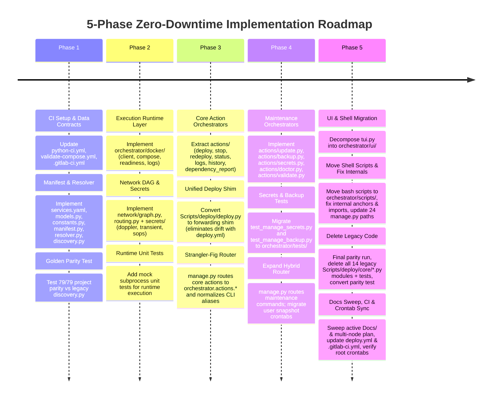
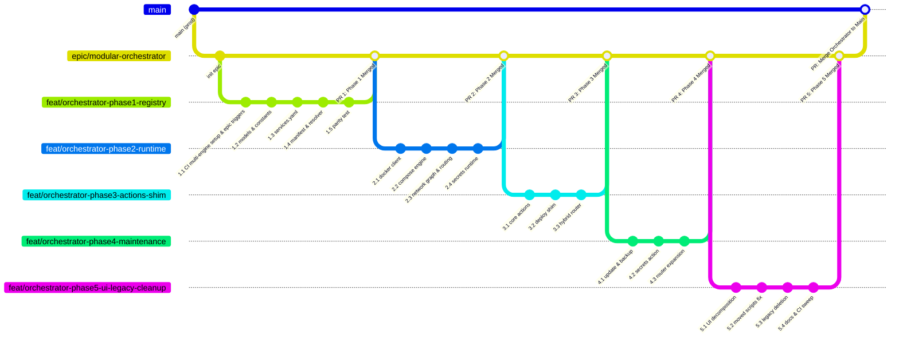

# Polaris Orchestration Architecture Refactoring

**Date**: 2026-08-18  
**Status**: Approved (Ready for Implementation)  
**Scope**: Declarative Registry, Modular Packages, Docker Engine, Dependency Graph, Secrets, Actions, TUI, CI Drift Gates & Shell Script Migration  

---

## 1. Executive Summary & Problem Statement

### 1.1 Context
The `polaris` repository has evolved from a collection of standalone shell scripts into a unified Python management CLI (`manage.py`) driving 79+ containerized services across multiple VPS targets with dual-gateway networking, Doppler secret injection, and Restic backups.

### 1.2 Current Architecture Pain Points
1. **Monolithic Procedural Files**:
   - `Scripts/deploy/deploy.py` (779 lines) mixes CLI argument parsing, dependency topological sorting, image build detection, Docker Compose invocation, update checks, and secret materialization.
   - `Scripts/deploy/core/tui.py` (1016 lines) combines ANSI terminal raw-mode byte parsing, Rich layout widgets, live container inspection, and action execution.
   - `manage.py` (568 lines) mixes CLI dispatching, confirmation gates, deprecated alias mappings, and 24+ hardcoded `os.path.join(REPO_ROOT, "Scripts", ...)` subprocess calls.
   - `Scripts/deploy/core/doppler_manager.py` (590 lines) contains Doppler SaaS API logic, secret pruning algorithms, SOPS fallback loading, transient 0600 `.env` lifecycle management, and compose command wrapping.
   - `Scripts/deploy/core/updater.py` (525 lines) + `Scripts/deploy/core/check_upgrades.py` (445 lines) mix registry querying, backup image tagging, and upgrade orchestration.
2. **Untyped Dictionaries & Fragile Contracts**:
   - Services are passed between functions as untyped `dict` instances (`p['rel_dir']`, `p['name']`, `p['vps']`). Missing keys or typos fail only at runtime.
3. **Scattered Hardcoded Knowledge**:
   - Node placement (`VPS_B_PREFIXES`), core infrastructure prioritization (`CORE_INFRA_NAMES`), category mappings, and exclude paths are hardcoded across multiple separate files.
4. **Legacy `Scripts/` Organization & Shell Script Sprawl**:
   - The directory name `Scripts/` reflects early ad-hoc utility scripts. Furthermore, `Scripts/` lacks `__init__.py` files throughout, relying on ad-hoc `sys.path` mutations. Shell scripts (`backup/*.sh`, `network/*.sh`, `utils/*.sh`, `hooks/*`) are mixed with Python modules without a dedicated hierarchy.

---

## 2. Target Architecture & Package Layout

All orchestration logic and supporting shell scripts will be organized under a proper Python package (`orchestrator/`), with `manage.py` serving as a thin, declarative CLI entry point.

```
orchestrator/               # Core orchestration package (replacing monolithic Scripts/)
│
├── __init__.py
├── core/                   # Shared runtime state, history, constants & base models
│   ├── __init__.py
│   ├── constants.py        # REPO_ROOT, EXCLUDE_DIRS, file paths (nodes are manifest-derived)
│   ├── models.py           # Typed dataclasses (ServiceMetadata, ActionContext, ExecutionResult, etc.)
│   ├── state.py            # .active_vps context & .last_deploy_<vps> state tracking
│   └── history.py          # Action audit logging & persistence (.history.jsonl)
│
├── registry/               # Service metadata, models, and manifest
│   ├── __init__.py
│   ├── manifest.py         # services.yaml loader & drift validator
│   ├── resolver.py         # 3-tier target query resolution engine (exact/name/suffix)
│   ├── discovery.py        # Dynamic directory scanner (fallback & sync engine)
│   └── services.yaml       # Central declarative service manifest (single source of truth)
│
├── docker/                 # Pure Docker & Compose execution engine
│   ├── __init__.py
│   ├── client.py           # Typed Docker CLI wrapper (ps, stop, inspect, containers)
│   ├── compose.py          # Docker Compose executor (up, stop, pull, build, config)
│   ├── readiness.py        # Health probe and container readiness wait polling
│   └── logs.py             # Container log resolver and stream runner
│
├── network/                # Dependency graph & routing utilities
│   ├── __init__.py
│   ├── graph.py            # Sidecar dependency DAG & topological deployment sorter
│   └── routing.py          # Tailscale / Gluetun interface reset & routing wrappers
│
├── secrets/                # Doppler SaaS & SOPS snapshot management
│   ├── __init__.py
│   ├── doppler.py          # Doppler CLI API (download, sync, audit, prune)
│   ├── sops.py             # SOPS / age encryption & offline snapshot cache
│   ├── snapshots.py        # Offline snapshot git worktree sync & management
│   └── transient.py        # Secure 0600 .env materialization & cleanup
│
├── actions/                # Isolated command orchestrators (invoked by CLI/TUI)
│   ├── __init__.py
│   ├── base.py             # BaseAction abstract contract
│   ├── deploy.py           # Deploy workflow (gateways -> core infra -> standard apps)
│   ├── stop.py             # Stop workflow (targeted, VPS-scoped, global)
│   ├── redeploy.py         # Active container refresh & recreate workflow
│   ├── update.py           # Registry check, age-gate, image backups, update engine
│   ├── backup.py           # Restic backup & restore orchestrator
│   ├── secrets.py          # Doppler SaaS & snapshot management action
│   ├── doctor.py           # Pre-flight infrastructure diagnostic probes
│   ├── validate.py         # Compose, Caddyfile, and Manifest drift verification
│   ├── status.py           # Real-time container health & port inspection action
│   ├── logs.py             # Stream container logs action
│   ├── history.py          # Operation audit log viewer action
│   └── dependency_report.py# Container dependency report generator action
│
├── ui/                     # Presentation layer
│   ├── __init__.py
│   ├── dashboard.py        # Interactive Rich TUI menu engine
│   ├── inspector.py        # Terminal rendering of live container health & ports table
│   └── prompts.py          # Confirmation gates & terminal raw-mode context
│
├── tests/                  # Unit and integration test suite
│   ├── __init__.py
│   ├── test_registry_parity.py # Golden parity test (Phase 1)
│   ├── test_manifest.py    # services.yaml schema & drift tests
│   ├── test_resolver.py    # Target query resolution tests
│   ├── test_docker.py      # Docker client and compose engine tests
│   ├── test_network.py     # DAG dependency graph tests
│   ├── test_secrets.py     # Doppler and transient env runtime tests (Phase 2)
│   ├── test_actions.py     # Action orchestrator tests
│   ├── test_manage_backup.py  # Migrated backup router tests (Phase 4)
│   └── test_manage_secrets.py # Migrated secrets router tests (Phase 4)
│
└── scripts/                # Dedicated home for remaining supporting bash & maintenance scripts
    ├── backup/             # backup-all.sh, restore-all.sh, backup-check.sh, etc.
    ├── network/            # fix-routing.sh
    ├── utils/              # build-local-app.sh, update-netbird-server.sh
    └── hooks/              # pre-commit, install-hooks.sh
```

---

## 3. Core Data Contracts (`orchestrator/core/models.py`)

Every component communicates via typed, immutable `@dataclass` contracts and strict enums:

```python
# orchestrator/core/models.py
from dataclasses import dataclass, field
from enum import Enum
from pathlib import Path
from typing import Optional

class ServiceTier(int, Enum):
    GATEWAY = 0      # Network gateways (Gluetun + Tailscale)
    CORE_INFRA = 1   # Auth, SSO, Cloudflare Tunnel, Vaultwarden
    STANDARD = 2     # Default applications
    MONITORING = 3   # Uptime-Kuma, Dozzle

class ContainerStatus(str, Enum):
    RUNNING = "running"
    EXITED = "exited"
    HEALTHY = "healthy"
    UNHEALTHY = "unhealthy"
    DEAD = "dead"
    UNKNOWN = "unknown"

@dataclass(frozen=True)
class ServiceMetadata:
    """Immutable contract describing a single managed compose service."""
    name: str
    rel_dir: str
    abs_dir: Path
    compose_file: str
    category: str
    vps: str                         # Concrete node identifier: "A", "B", "C", "storage", etc.
    tier: ServiceTier = ServiceTier.STANDARD
    custom_project_name: Optional[str] = None
    network_dependency: Optional[str] = None
    is_build_heavy: bool = False     # Explicit build indicator (monochrome, fmhy, custom build context)
    env_file_required: bool = False
    appdata_paths: list[Path] = field(default_factory=list)

@dataclass
class ActionContext:
    """Standardized runtime invocation options passed from CLI/TUI to action orchestrators."""
    targets: list[str] = field(default_factory=list)
    vps: Optional[str] = None        # If None, dynamically resolves via state.get_active_vps()
    dry_run: bool = False
    yes: bool = False
    recreate: bool = False
    build: bool = False
    force_gateways: bool = False
    min_age: float = 0.0
    backup_days: int = 7
    resume_from: Optional[str] = None

@dataclass
class ExecutionResult:
    """Standardized result returned by all orchestration operations."""
    service: Optional[ServiceMetadata]
    action: str
    success: bool
    exit_code: int = 0
    message: str = ""
    duration_seconds: float = 0.0

@dataclass
class ContainerState:
    """Snapshot of a container's runtime state from Docker."""
    container_id: str
    name: str
    status: ContainerStatus
    is_active: bool
    ports: list[str] = field(default_factory=list)
```

---

## 4. Declarative Service Registry (`services.yaml`) & Drift Policy

### 4.1 Schema Definition
`orchestrator/registry/services.yaml` is the centralized declarative manifest:

```yaml
defaults:
  compose_file: docker-compose.yml
  vps: A
  tier: 2

# Supported VPS/Node targets (extensible to any arbitrary count)
nodes:
  - id: A
    name: Primary Core & Media Stack
  - id: B
    name: Secondary Stremio & Tooling Node

services:
  # -------------------------------------------------------------
  # Network Gateways
  # -------------------------------------------------------------
  - name: gateway-core
    path: Media/local-media/gateway
    category: Network (Gateways)
    tier: 0
    custom_project: network-media-local-media-gateway
    vps: A

  - name: gateway-b
    path: Utilities/gateway-b
    category: Network (Gateways)
    tier: 0
    custom_project: network-utilities-gateway-b
    vps: B

  # -------------------------------------------------------------
  # Core Infrastructure & Auth
  # -------------------------------------------------------------
  - name: pocketid
    path: Utilities/auth/pocketid
    category: Utilities (Auth)
    tier: 1
    vps: A

  - name: oauth2-proxy
    path: Utilities/auth/oauth2-proxy
    category: Utilities (Auth)
    tier: 1
    vps: A

  # -------------------------------------------------------------
  # Local Media Stack
  # -------------------------------------------------------------
  - name: bazarr
    path: Media/local-media/managers/bazarr
    category: Media/local-media (Managers)
    vps: A
    network_dependency: media-gateway-core-gluetun

  - name: jellyfin
    path: Media/local-media/players/jellyfin
    category: Media/local-media (Players)
    vps: A
    network_dependency: media-gateway-core-gluetun

  # -------------------------------------------------------------
  # VPS B Addons & Tools
  # -------------------------------------------------------------
  - name: aiostreams
    path: Media/stremio/addons/aiostreams
    category: Media/stremio
    vps: B
    network_dependency: stremio-addons-gateway-gluetun
```

### 4.2 Source-of-Truth & CI Drift Gate
1. **Manifest-as-Truth Principle**: `services.yaml` is the strict, authoritative definition of all deployed services and nodes.
2. **Node Validation**: At manifest load time, every `vps` value is strictly validated against the registered `nodes` set in `services.yaml` (single source of truth; no secondary hardcoded node lists in code).
3. **CI Hosting & Drift Gate**:
   - The drift gate lives inside **[`.github/workflows/validate-compose.yml`](.github/workflows/validate-compose.yml)** (which triggers on `**/docker-compose.yml`, `**/.env.example`, and `orchestrator/registry/services.yaml`).
   - A dedicated verification step runs `python3 -m orchestrator.registry.manifest --validate-drift`.
   - **Zero Extra Dependency Constraint**: Because `validate-compose.yml` installs only `pyyaml`, the drift validator and the `registry` package MUST rely strictly on Python stdlib + `PyYAML` alone (zero imports of `rich`, `docker`, or other third-party dependencies).
   - Any PR adding, moving, or deleting a `docker-compose.yml` on disk without updating `services.yaml` **fails the CI check immediately**.
4. **Drift-Gate Exclusion Set**: The drift scanner strictly reuses `EXCLUDE_DIRS` from `orchestrator.core.constants` (`{".git", "node_modules", "cache", "state", "data", "logs", "src", "cloud-data", "zurg", "rd", "tb", "Archived"}`) to ensure compose files in `Archived/` or test/cache fixtures never cause false CI failures.
5. **Scaffolding Tool**: Developers can run `./manage.py validate --fix` or `./manage.py utils sync-manifest`, which scans disk for unregistered compose files and appends template entries into `services.yaml` for review.

---

## 5. Blast Radius, Workflow Changes & Reference Inventory

### 5.1 Zero New Dependencies
`PyYAML==6.0.3` and `rich==15.0.0` are already pinned in [`requirements.txt`](requirements.txt) (inherited by `requirements-dev.txt` via `-r requirements.txt`). **Phase 1 introduces zero new third-party dependencies.**

### 5.2 Complete Inventory of Path References to Update

| File / Component | Current Reference | Target Update | Phase |
| :--- | :--- | :--- | :--- |
| **`.github/workflows/python-ci.yml`** | `paths: ["Scripts/**", ...]`<br>`pytest Scripts/ -v`<br>`ruff check Scripts/ manage.py` | Add `orchestrator/**` to paths, pytest, and ruff check | **Phase 1** |
| **`.github/workflows/validate-compose.yml`** | `paths: ["**/docker-compose.yml", ...]` | Add `orchestrator/registry/services.yaml` to paths + add Manifest Drift Validation step | **Phase 1** |
| **`.gitlab-ci.yml`** | `paths: ["Scripts/**/*", ...]`<br>`ruff check Scripts/ manage.py`<br>`unittest discover -s Scripts/deploy/core`<br>`unittest discover -s Scripts` | • **Phase 1**: Add `orchestrator/**` to paths, ruff, and test discovery; add `services.yaml` trigger & manifest drift validation step to `validate-compose`<br>• **Phase 5**: Remove legacy `Scripts/` paths and discovery | **Phase 1/5** |
| **`AGENTS.md`** | • Repo layout tree (`manage.py`, `Scripts/`)<br>• Defense-in-depth hook path (`Scripts/utils/hooks/pre-commit`)<br>• Hook management commands (`manage.py hooks`)<br>• Unit test commands (`python3 -m unittest discover -s Scripts/...`) | • Update layout tree to show `orchestrator/`<br>• Update hook path to `orchestrator/scripts/hooks/pre-commit`<br>• Update test discovery to `python3 -m unittest discover -s orchestrator` | **Phase 1/5** |
| **`orchestrator/core/constants.py`** | `Scripts/deploy/core/utils.py` constants | Consolidate `REPO_ROOT` and `EXCLUDE_DIRS` (nodes are manifest-derived) | **Phase 1** |
| **`manage.py`** | `sys.path.append(...Scripts/deploy/core)`<br>24 `os.path.join(REPO_ROOT, "Scripts", ...)` paths | • **Phases 3–4**: Strangler-fig hybrid router dispatching migrated actions to `orchestrator.actions.*`<br>• **Phase 5**: Full direct router; update all 24 shell paths to `orchestrator/scripts/...` | **Phase 3/4/5** |
| **`Scripts/deploy/deploy.py` (Forwarding Shim)** | Main deployment engine executed by `deploy.yml` on production VPS | Convert immediately into a forwarding shim that forwards `sys.argv[1:]` verbatim to `orchestrator.actions.deploy.main()` and preserves exit codes (guarantees zero divergence between local and CI deployments) | **Phase 3** |
| **`Scripts/test_manage_secrets.py`** | Direct CLI test on legacy Doppler/secrets router | Migrate to `orchestrator/tests/test_manage_secrets.py` alongside `actions/secrets.py` | **Phase 4** |
| **`Scripts/test_manage_backup.py`** | Direct CLI test on legacy backup router | Migrate to `orchestrator/tests/test_manage_backup.py` alongside `actions/backup.py` | **Phase 4** |
| **Production VPS Crontabs (User & Root)** | User cron: `sync-snapshots.sh`<br>Root cron: backup execution | • **Phase 4**: Update user cron to `./manage.py secrets sync-branch`<br>• **Phase 5**: Ensure root cron executes `./manage.py backup run` (not direct script path) | **Phase 4/5** |
| **`.github/workflows/deploy.yml`** | Lines 74-75, 141, 179-180, 246: `Scripts/deploy/deploy.py`<br>Lines 102, 207: `grep -q -E "^Scripts/deploy/|^\.env\.example"` | • Update grep to `grep -q -E "^orchestrator/|^manage\.py|^\.env\.example"`<br>• Forwarding shim at `Scripts/deploy/deploy.py` remains active | **Phase 5** |
| **`.github/workflows/dependency-report.yml`** | Line 26: `python3 Scripts/utils/generate_dependency_report.py` | `python3 -m orchestrator.actions.dependency_report` or `./manage.py utils dependency-report` | **Phase 5** |
| **`orchestrator/scripts/hooks/`** | `Scripts/utils/hooks/pre-commit`, `install-hooks.sh` | Update hook target paths to point to `orchestrator/scripts/hooks/` | **Phase 5** |
| **Operational Documentation (`Docs/`)** | `BACKUP_RESTORE_GUIDE.md`, `DOPPLER_OPERATIONS_GUIDE.md`, `NETWORK_ARCHITECTURE.md`, `NETBIRD_SELFHOSTING.md`, `RENOVATE_AUTOMATION_GUIDE.md`, `SOPS_DOPPLER_SNAPSHOT_PLAN.md`, `Docs/plans/idempotent-multi-node/` | • Update active references from `Scripts/...` to `orchestrator/...` or `./manage.py` CLI commands<br>• Note: `Docs/plans/idempotent-multi-node/` is rebased post-refactor to target `orchestrator/` domain packages (historical commit logs like `DOPPLER_MIGRATION_COMMIT_REFERENCE.md` are exempt; `README.md`, `renovate.json`, and `.pi/extensions/` verified clean) | **Phase 5** |

---

## 6. Phased Implementation Roadmap



### Phase 1: CI Setup, Data Contracts, Manifest, Resolver & Golden Parity Test
- **CI First**: Update `.github/workflows/python-ci.yml`, `.github/workflows/validate-compose.yml`, and `.gitlab-ci.yml` so `orchestrator/` is linted, tested, and drift-validated on every push from Day 1 across both GitHub Actions and GitLab CI.
- **Core Constants & Models**: Implement `orchestrator/core/constants.py` (`REPO_ROOT`, `EXCLUDE_DIRS`) and `orchestrator/core/models.py` (`ServiceMetadata`, `ActionContext`, `ExecutionResult`, `ContainerStatus`).
- **Manifest**: Create `orchestrator/registry/services.yaml` capturing all 79 projects with exact paths, categories, tiers, custom project names, and gateway dependencies.
- **Manifest Loader, Resolver & Discovery Engine**: Implement `orchestrator/registry/manifest.py`, `resolver.py`, and `discovery.py` (housing filesystem scan, drift detection, and `discover_appdata_paths()`, strictly zero third-party dependencies outside stdlib + `PyYAML`).
- **Golden Parity Unit Test**: Implement `test_registry_parity.py` asserting that resolving `services.yaml` yields 100% field-by-field equality with legacy `discover_compose_projects()` and `get_project_name()` across all 79 services.

### Phase 2: Complete Execution Runtime (Docker Engine, Network DAG, Routing & Secrets)
- **Docker Engine**: Implement `orchestrator/docker/` (`client.py`, `compose.py`, `readiness.py`, `logs.py`).
- **Network DAG & Routing**: Implement `orchestrator/network/graph.py` (DAG dependency sorter replacing procedural sort keys) and `orchestrator/network/routing.py` (`reset_tailscale_state()`, `apply_routing_fix()`).
- **Secrets Runtime**: Implement `orchestrator/secrets/` (`doppler.py`, `transient.py`, `sops.py`), providing Doppler process command wrapping, transient 0600 `.env` materialization, and SOPS snapshot loading.
- **Runtime Unit Tests**: Add unit tests with mock subprocess runners verifying compose commands, Doppler wrapping, routing helpers, and readiness timeouts.

### Phase 3: Core Action Orchestrators, Forwarding Shim & Strangler-Fig Router
- **Core Actions**: Implement `orchestrator/actions/` (`deploy.py`, `stop.py`, `redeploy.py`, `status.py`, `logs.py`, `history.py`, `dependency_report.py`), fully consuming the completed `docker/`, `network/`, and `secrets/` runtime from Phase 2.
- **State & History**: Implement `orchestrator/core/state.py` (context tracking) and `orchestrator/core/history.py` (audit logging).
- **Zero-Drift Forwarding Shim**: Convert `Scripts/deploy/deploy.py` immediately into a forwarding shim delegating directly to `orchestrator.actions.deploy.main()` with complete `argv` fidelity. This guarantees that both local `./manage.py deploy` and production CI `deploy.yml` run the exact same deployment engine with zero drift.
- **Strangler-Fig Router**: Update `manage.py` to route core commands (`deploy`, `stop`, `redeploy`, `status`, `logs`, `history`, `dependency-report`) directly to `orchestrator.actions.*`, normalize deprecated CLI aliases (§7.4), while non-migrated commands continue delegating to legacy modules.

### Phase 4: Maintenance Orchestrators, Router Expansion & User Crontab Migration
- **Update Engine**: Implement `orchestrator/actions/update.py` (wrapping `check_upgrades` + `updater` with registry age-gating and image backup tagging).
- **Backup & Diagnostics**: Implement `orchestrator/actions/backup.py` (Restic orchestration) and `orchestrator/actions/doctor.py`. Note: `actions/backup.py` must preserve the post-backup auto-sync chain (`manage.py:466-471`), automatically invoking snapshot synchronization via `secrets/snapshots.py` on backup success.
- **Secrets Action & Worktree Sync**: Implement `orchestrator/actions/secrets.py` and `orchestrator/secrets/snapshots.py` (absorbing git worktree snapshot sync).
- **Manifest Drift Validator**: Implement manifest drift validation (`validate --fix`) in `orchestrator/actions/validate.py`.
- **Test Migration**: Migrate `Scripts/test_manage_secrets.py` and `Scripts/test_manage_backup.py` to `orchestrator/tests/`.
- **Expand Router**: Update `manage.py` strangler-fig router to dispatch `update`, `backup`, `doctor`, `validate`, and `secrets` to `orchestrator.actions.*`.
- **VPS User Crontab Migration**: Audit and update user crontabs on VPS A and VPS B, updating direct `sync-snapshots.sh` invocations to `./manage.py secrets sync-branch`.

### Phase 5: UI Modularization, Shell Migration, Script Internals Fix, Legacy Deletion, Docs Sweep & CI Sync
- **UI Modularization**: Refactor `tui.py` into `orchestrator/ui/` (`dashboard.py`, `inspector.py`, `prompts.py`).
- **Move Shell Scripts & Fix Internals**:
  - Move remaining bash scripts (`backup/*.sh`, `network/fix-routing.sh`, `utils/build-local-app.sh`, `utils/update-netbird-server.sh`, `hooks/pre-commit`, `install-hooks.sh`) into `orchestrator/scripts/`.
  - Fix directory depth anchors from `/../..` to `/../../..` (`build-local-app.sh`, `backup-all.sh`, `restore-all.sh`, `update-netbird-server.sh`).
  - Fix internal hook and helper paths (`backup-all.sh:368,446` -> `orchestrator/scripts/backup/pre-backup-hook.sh`, `install-hooks.sh:29` -> `orchestrator/scripts/hooks/pre-commit`).
  - Fix embedded Python imports in `backup-all.sh:301` and `pre-backup-hook.sh:50` to `from orchestrator.registry.discovery import discover_appdata_paths`.
  - Update all 24 `manage.py` subprocess paths.
- **Legacy Deletion & Parity Conversion**:
  - Run the final golden parity test run (`test_registry_parity.py`).
  - Delete all 14 legacy Python non-test modules under `Scripts/deploy/core/*.py` (`discovery.py`, `tui.py`, `doppler_manager.py`, `snapshot_manager.py`, `updater.py`, `check_upgrades.py`, `utils.py`, `validator.py`, `logs.py`, `status.py`, `history.py`, `commands.py`, `doctor.py`, `sops_bootstrap.py`) along with their 9 colocated tests (`test_*.py`), plus top-level `Scripts/test_manage_backup.py` and `Scripts/test_manage_secrets.py`.
  - Convert `test_registry_parity.py` into a static snapshot regression test against `services.yaml`.
- **Docs & Multi-Node Plan Sweep**:
  - Update all active operational guides in `Docs/` (`BACKUP_RESTORE_GUIDE.md`, `DOPPLER_OPERATIONS_GUIDE.md`, `NETWORK_ARCHITECTURE.md`, `NETBIRD_SELFHOSTING.md`, `RENOVATE_AUTOMATION_GUIDE.md`, `SOPS_DOPPLER_SNAPSHOT_PLAN.md`) to reference `orchestrator/` paths and `manage.py` commands.
  - Note: `Docs/plans/idempotent-multi-node/` is rebased post-refactor to build directly on `orchestrator/registry` and `orchestrator/actions`.
- **Production VPS Safety & Crontab Verification**:
  - Update `.github/workflows/deploy.yml` change-detection regex to `^orchestrator/|^manage\.py|^\.env\.example` (the forwarding shim at `Scripts/deploy/deploy.py` created in Phase 3 remains permanently in place).
  - Update `.gitlab-ci.yml` path filters and test commands to drop `Scripts/`.
  - Verify root crontabs across both VPS nodes execute `./manage.py backup run`.

---

## 7. Codebase Trimming & Legacy Deprecation Inventory

This refactor will prune obsolete stubs, eliminate duplicated shell discovery logic, and replace scattered procedural heuristics with declarative registry attributes:

### 7.1 Dead Code & Obsolete Stubs to Remove
1. **`manage.py utils env` / `bootstrap-env`**:
   - **Reason**: Dead stub printing `[INFO] Static .env bootstrapping is archived.` Leftover from the Doppler SaaS migration. Removed completely in Phase 3.
2. **`sops_bootstrap.py` Platform Binary Downloader**:
   - **Reason**: ~85 lines of platform-specific tarball/zip downloaders (`:66-151`) for SOPS & age. Modern systems manage binaries natively.
   - **Action**: Downloader not ported; only `setup_age_key_env()` absorbed into `orchestrator.secrets.sops` in Phase 2; legacy `sops_bootstrap.py` module deleted in Phase 5 alongside other legacy modules.

### 7.2 Duplicated Shell Logic Replaced by Native Python
1. **`Scripts/network/reset-tailscale.sh`** (79 lines of bash):
   - **Reason**: Re-implements Compose discovery, directory traversal, and project name generation via fragile `find`, `grep`, `sed` pipelines.
   - **Action**: Implemented in `orchestrator.network.routing` in Phase 2; wired to `./manage.py network reset` and bash script deleted in Phase 5.
2. **`Scripts/utils/sync-snapshots.sh`** (186 lines of bash):
   - **Reason**: Manages git worktrees to commit `.snapshots/` to the `secrets-snapshots` branch.
   - **Action**: Absorbed in Phase 4 into `orchestrator.secrets.snapshots` with native Python `subprocess` error handling.

### 7.3 Procedural Heuristic Arrays Eliminated by `services.yaml`
Scattered procedural heuristics across legacy scripts are replaced by declarative fields in `services.yaml` and typed properties on `ServiceMetadata`:

| Legacy Procedural Logic | Location | Replaced By |
| :--- | :--- | :--- |
| **`VPS_B_PREFIXES`** | `discovery.py:11-24` | Explicit `vps: B` in `services.yaml`. |
| **`CORE_INFRA_NAMES`** | `deploy.py:41` | `tier: 1` (`ServiceTier.CORE_INFRA`) in `services.yaml`. |
| **`is_build_heavy()` string checks** | `deploy.py:43` | `is_build_heavy: true` boolean property on `ServiceMetadata`. |
| **`gateway_sort_key()` procedural sorter** | `deploy.py:706` | DAG topological deployment order in `orchestrator.network.graph`. |
| **`category` substring logic** | `discovery.py:35-75` | Explicit `category:` defined directly in `services.yaml`. |

### 7.4 Deprecated CLI Aliases Streamlined in `manage.py`
The following legacy and redundant CLI aliases will be consolidated to standard canonical forms in Phase 3 (note: this is a breaking change for external callers relying on old aliases):
- `./manage.py deploy --redeploy` → `./manage.py redeploy`
- `./manage.py deploy --stop` → `./manage.py stop`
- `./manage.py utils report` → `./manage.py utils dependency-report`
- `./manage.py secrets sync-snapshots` → `./manage.py secrets sync-branch`
- `./manage.py network fix-routing` → `./manage.py network fix`
- `./manage.py network reset-tailscale` → `./manage.py network reset`

---

## 8. Branching & Merging Strategy

To ensure zero risk to `main` while maintaining full CI validation and traceability throughout the 5-phase migration, the refactoring will adhere to an **Epic Integration Branching Model**:



### 8.1 Branching Rules & Workflow
1. **Base Integration Branch**: `epic/modular-orchestrator` is cut from `main`. `main` remains untouched throughout development.
2. **Phase Feature Branches**: Each phase is developed on a dedicated branch off `epic/modular-orchestrator`:
   - `feat/orchestrator-phase1-registry`
   - `feat/orchestrator-phase2-runtime`
   - `feat/orchestrator-phase3-actions-shim`
   - `feat/orchestrator-phase4-maintenance`
   - `feat/orchestrator-phase5-ui-legacy-cleanup`
3. **Commit Granularity**: Each milestone within a phase represents one atomic commit with a clear Conventional Commit message (`feat(orchestrator): ...`, `test(orchestrator): ...`, `fix(orchestrator): ...`).
4. **Phase PR Verification Gates**: Before merging any phase branch into `epic/modular-orchestrator`, all of the following must pass:
   - Unit test suites (`python3 -m unittest discover -s orchestrator` and `Scripts/`).
   - Compose & manifest drift validation (`./manage.py validate`).
   - GitHub Actions CI & GitLab CI validation jobs.
5. **Final Release PR**: Once Phase 5 is fully verified on `epic/modular-orchestrator`, a final PR is opened from `epic/modular-orchestrator` into `main` (merged via merge commit to preserve milestone history, or squash-merged per repository preferences).

---

## 9. Granular Commit Milestone Checklists

### Phase 1: CI Setup, Data Contracts, Manifest, Resolver & Golden Parity Test
*Branch:* `feat/orchestrator-phase1-registry` (off `epic/modular-orchestrator`)

- [x] **Milestone 1.1: CI Multi-Engine Setup & Epic Branch Triggers**
  - Update `.github/workflows/python-ci.yml`:
    - Add `epic/modular-orchestrator` and `"epic/**"` to `push.branches` and `pull_request.branches`.
    - Add `orchestrator/**` to `paths:`.
    - Add `orchestrator/` to `pytest` and `ruff check`.
  - Update `.github/workflows/validate-compose.yml`:
    - Add `epic/modular-orchestrator` and `"epic/**"` to `push.branches` and `pull_request.branches`.
    - Add `orchestrator/registry/services.yaml` to `paths:`.
    - Add Manifest Drift Validation step running PyYAML check.
  - Update `.gitlab-ci.yml`:
    - Add `orchestrator/**` to paths, ruff check, and test discovery.
    - Add `services.yaml` trigger and manifest drift check to `validate-compose`.
  - **Commit:** `ci(workflows): add orchestrator paths, epic triggers, and manifest drift checks to github and gitlab ci`
- [x] **Milestone 1.2: Core Constants & Domain Models**
  - Implement `orchestrator/__init__.py` and `orchestrator/core/__init__.py`.
  - Implement `orchestrator/core/constants.py` (`REPO_ROOT`, `EXCLUDE_DIRS`).
  - Implement `orchestrator/core/models.py` (`ServiceTier`, `ContainerStatus`, `ServiceMetadata`, `ActionContext`, `ExecutionResult`).
  - **Commit:** `feat(core): implement core constants and domain models`
- [x] **Milestone 1.3: Declarative Services Manifest**
  - Implement `orchestrator/registry/services.yaml` capturing all 79 services, categories, tiers, custom names, and node placements (`nodes:` with `{id, name}`).
  - **Commit:** `feat(registry): create central declarative services.yaml manifest`
- [x] **Milestone 1.4: Manifest Loader & Schema Validator**
  - Implement `orchestrator/registry/manifest.py` (`load_manifest`, `validate_manifest`, zero non-stdlib dependencies outside `PyYAML`).
  - **Commit:** `feat(registry): implement manifest loader and schema validation`
- [x] **Milestone 1.5: 3-Tier Target Query Resolver & Discovery Helper**
  - Implement `orchestrator/registry/resolver.py` (`resolve_targets`, `resolve_all_services`, exact/name/suffix matching).
  - Implement `orchestrator/registry/discovery.py` (`discover_appdata_paths`, filesystem drift detector).
  - **Commit:** `feat(registry): implement target query resolver and discovery helpers`
- [x] **Milestone 1.6: Golden Parity Test Suite**
  - Implement `orchestrator/tests/test_registry_parity.py` (verifying 79/79 project 100% field equality with legacy `discovery.py`).
  - Implement `orchestrator/tests/test_manifest.py` and `orchestrator/tests/test_resolver.py`.
  - Run test suite and verify 100% parity.
  - **Commit:** `test(registry): add golden parity and manifest resolution test suites`

---

### Phase 2: Complete Execution Runtime (Docker Engine, Network DAG & Secrets)
*Branch:* `feat/orchestrator-phase2-runtime` (off `epic/modular-orchestrator`)

- [x] **Milestone 2.1: Typed Docker CLI Wrapper**
  - Implement `orchestrator/docker/client.py` (`get_container_status`, `inspect_container`, `stop_containers`).
  - **Commit:** `feat(docker): implement typed docker cli client`
- [x] **Milestone 2.2: Compose Executor & Readiness Poller**
  - Implement `orchestrator/docker/compose.py` (`compose_up`, `compose_down`, `compose_pull`, `compose_build`, `compose_config`).
  - Implement `orchestrator/docker/readiness.py` (polling health checks with configurable timeouts).
  - **Commit:** `feat(docker): implement compose executor and readiness polling engine`
- [x] **Milestone 2.3: Container Log Streamer**
  - Implement `orchestrator/docker/logs.py` (container log resolution and streaming).
  - **Commit:** `feat(docker): implement container logs streaming handler`
- [x] **Milestone 2.4: Network Dependency DAG & Routing Utilities**
  - Implement `orchestrator/network/graph.py` (DAG dependency resolver and topological sorter).
  - Implement `orchestrator/network/routing.py` (`reset_tailscale_state`, `apply_routing_fix`).
  - **Commit:** `feat(network): implement dependency graph DAG and routing engine`
- [x] **Milestone 2.5: Doppler CLI Wrapper & Transient 0600 `.env` Manager**
  - Implement `orchestrator/secrets/doppler.py` (Doppler command wrapper and secrets API).
  - Implement `orchestrator/secrets/transient.py` (0600-permissioned `.env` materialization and guaranteed cleanup).
  - **Commit:** `feat(secrets): implement doppler wrapper and transient env manager`
- [x] **Milestone 2.6: SOPS Key Resolver & Runtime Unit Tests**
  - Implement `orchestrator/secrets/sops.py` (absorbing `setup_age_key_env()`, omitting binary downloader).
  - Implement `orchestrator/tests/test_docker.py`, `test_network.py`, and `test_secrets.py`.
  - Run test suite and verify 100% passing.
  - **Commit:** `feat(secrets): implement sops key resolver and runtime unit tests`

---

### Phase 3: Core Action Orchestrators, Deploy Forwarding Shim & Strangler-Fig Router
*Branch:* `feat/orchestrator-phase3-actions-shim` (off `epic/modular-orchestrator`)

- [x] **Milestone 3.1: Core State & Audit History Persistence**
  - Implement `orchestrator/core/state.py` (`.active_vps` tracking, `.last_deploy_<vps>` context).
  - Implement `orchestrator/core/history.py` (append-only `.history.jsonl` audit logging).
  - **Commit:** `feat(core): implement state context and operation history audit persistence`
- [x] **Milestone 3.2: Base Action Contract, Stop, Status, Logs & History Actions**
  - Implement `orchestrator/actions/base.py` (`BaseAction` abstract interface).
  - Implement `orchestrator/actions/stop.py`, `orchestrator/actions/status.py`, `orchestrator/actions/logs.py`, `orchestrator/actions/history.py`.
  - **Commit:** `feat(actions): implement stop, status, logs, and history action orchestrators`
- [x] **Milestone 3.3: Deploy & Redeploy Orchestrators**
  - Implement `orchestrator/actions/deploy.py` (DAG gateway sequencing, Doppler wrapping, readiness waits).
  - Implement `orchestrator/actions/redeploy.py`.
  - **Commit:** `feat(actions): implement deploy and redeploy orchestrators`
- [x] **Milestone 3.4: Dependency Report Action**
  - Implement `orchestrator/actions/dependency_report.py`.
  - **Commit:** `feat(actions): implement dependency report action orchestrator`
- [x] **Milestone 3.5: Production Zero-Drift Deploy Forwarding Shim**
  - Convert `Scripts/deploy/deploy.py` into a thin forwarding shim with `sys.path` anchoring that delegates `sys.argv[1:]` verbatim to `orchestrator.actions.deploy.main()` and preserves exit codes.
  - Verify the forwarding shim locally via `python3 Scripts/deploy/deploy.py --dry-run --vps A` and `./manage.py deploy --dry-run --vps A` from a clean checkout, ensuring complete `argv` fidelity and zero regression.
  - **Commit:** `feat(deploy): convert legacy deploy.py into orchestrator forwarding shim`
- [x] **Milestone 3.6: Strangler-Fig Hybrid Router & CLI Alias Normalization**
  - Refactor `manage.py` to route migrated actions (`deploy`, `stop`, `redeploy`, `status`, `logs`, `history`, `dependency-report`) directly to `orchestrator.actions.*`.
  - Remove dead `manage.py utils env` stub.
  - Normalize all six legacy aliases in `manage.py` (§7.4):
    1. `./manage.py deploy --redeploy` → `./manage.py redeploy`
    2. `./manage.py deploy --stop` → `./manage.py stop`
    3. `./manage.py utils report` → `./manage.py utils dependency-report`
    4. `./manage.py secrets sync-snapshots` → `./manage.py secrets sync-branch`
    5. `./manage.py network fix-routing` → `./manage.py network fix`
    6. `./manage.py network reset-tailscale` → `./manage.py network reset`
  - **Commit:** `refactor(cli): implement strangler-fig hybrid router in manage.py and normalize aliases`

---

### Phase 4: Maintenance Orchestrators, Worktree Sync & Router Expansion
*Branch:* `feat/orchestrator-phase4-maintenance` (off `epic/modular-orchestrator`)

- [x] **Milestone 4.1: Update & Image Upgrade Action**
  - Implement `orchestrator/actions/update.py` (wrapping registry age-gating, image backup tagging, container restart).
  - **Commit:** `feat(actions): implement update action orchestrator with age-gating`
- [x] **Milestone 4.2: Backup & Restore Action**
  - Implement `orchestrator/actions/backup.py` (Restic orchestration preserving post-backup auto-sync chain).
  - **Commit:** `feat(actions): implement backup and restore action orchestrator`
- [x] **Milestone 4.3: Secrets Action & Offline Git Worktree Snapshot Sync**
  - Implement `orchestrator/secrets/snapshots.py` (absorbing git worktree sync from `sync-snapshots.sh`).
  - Implement `orchestrator/actions/secrets.py` (open, verify, sync, audit, prune, snapshot, snapshots, sync-branch).
  - **Commit:** `feat(actions): implement secrets action orchestrator and worktree snapshot sync`
- [x] **Milestone 4.4: Pre-flight Doctor & Manifest Drift Validator**
  - Implement `orchestrator/actions/doctor.py` (diagnostics for Doppler, Tailscale, Docker, VPN).
  - Implement `orchestrator/actions/validate.py` (`validate --fix` sync).
  - **Commit:** `feat(actions): implement doctor and manifest drift validation actions`
- [x] **Milestone 4.5: Migrate CLI Tests & Expand Router**
  - Migrate `Scripts/test_manage_backup.py` and `Scripts/test_manage_secrets.py` to `orchestrator/tests/`.
  - Expand `manage.py` router to dispatch maintenance commands to `orchestrator.actions.*`.
  - Audit and migrate user snapshot crontabs on VPS A and VPS B to `./manage.py secrets sync-branch`.
  - **Commit:** `refactor(cli): expand hybrid router for maintenance actions and migrate cli test suite`

---

### Phase 5: UI Modularization, Shell Migration, Script Internals Fix, Legacy Deletion & Docs Sweep
*Branch:* `feat/orchestrator-phase5-ui-legacy-cleanup` (off `epic/modular-orchestrator`)

- [ ] **Milestone 5.1: Presentation Layer Decomposition**
  - Refactor `Scripts/deploy/core/tui.py` into `orchestrator/ui/` (`dashboard.py`, `inspector.py`, `prompts.py`).
  - Wire `./manage.py` default entrypoint to `orchestrator.ui.dashboard`.
  - **Commit:** `feat(ui): decompose tui into modular presentation components`
- [ ] **Milestone 5.2: Shell Scripts Relocation & Internal Fixes**
  - Move remaining bash scripts (`backup/*.sh`, `network/fix-routing.sh`, `utils/build-local-app.sh`, `utils/update-netbird-server.sh`, `hooks/pre-commit`, `install-hooks.sh`) into `orchestrator/scripts/`.
  - Fix directory depth anchors (`/../..` -> `/../../..`) in moved scripts.
  - Fix internal hook and helper paths (`backup-all.sh`, `install-hooks.sh`).
  - Fix embedded Python imports to `from orchestrator.registry.discovery import discover_appdata_paths`.
  - Update all 24 `manage.py` subprocess paths.
  - **Commit:** `refactor(scripts): move shell scripts to orchestrator/scripts/ and fix internal paths`
- [ ] **Milestone 5.3: Final Parity Verification & Legacy Module Deletion**
  - Run final golden parity test run (`test_registry_parity.py`).
  - Delete all 14 legacy Python non-test modules under `Scripts/deploy/core/*.py` + 9 colocated tests + top-level legacy tests.
  - Delete legacy shell scripts replaced by native Python (`reset-tailscale.sh`, `sync-snapshots.sh`).
  - Convert `test_registry_parity.py` into a static snapshot regression test against `services.yaml`.
  - **Commit:** `chore(legacy): purge legacy Scripts/deploy/core modules and convert parity test`
- [ ] **Milestone 5.4: Docs Sweep, CI Sync & Full System Verification**
  - Update `AGENTS.md` and active operational guides in `Docs/` (`BACKUP_RESTORE_GUIDE.md`, `DOPPLER_OPERATIONS_GUIDE.md`, etc.).
  - Rebase `Docs/plans/idempotent-multi-node/` to target `orchestrator/` packages.
  - Update `.github/workflows/deploy.yml` change-detection regex to `^orchestrator/|^manage\.py|^\.env\.example`.
  - Update `.gitlab-ci.yml` path filters and test commands to drop `Scripts/`.
  - Verify root backup crontab executes `./manage.py backup run`.
  - Run complete unit test and validation suites across the repository.
  - **Commit:** `docs(sweep): sweep operational guides and synchronize ci workflows for orchestrator`

---

## 10. Next Steps

1. Create integration base branch: `git checkout -b epic/modular-orchestrator main`
2. Create first phase branch: `git checkout -b feat/orchestrator-phase1-registry epic/modular-orchestrator`
3. Begin execution of **Milestone 1.1: CI Multi-Engine Setup & Epic Branch Triggers**.
