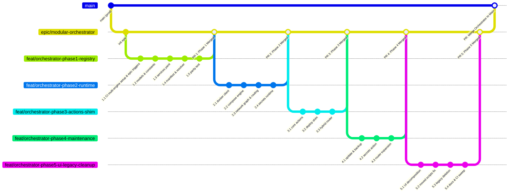

# CLI Modular Architecture Refactor — Master Plan & Execution Tracker

> **Tracking Directory:** `Docs/plans/cli-modular-architecture/`  
> **Base Epic Branch:** `epic/modular-orchestrator` (branched from `main`)  
> **Status:** Phase 5 Complete (Epic Ready for PR into main)

---

## 1. Executive Summary & Objective

This project refactors the Net-Stream command-line and management layer from monolithic procedural scripts in `Scripts/deploy/core/` (~4,600 LOC across 14 modules) into a decoupled, domain-driven package named `orchestrator/`.

### Key Outcomes
1. **Declarative Service Registry**: Central `services.yaml` replacing procedural heuristic regexes (`VPS_B_PREFIXES`, `CORE_INFRA_NAMES`, category substrings).
2. **Explicit Extensible Multi-Node Support**: Declarative node placement (`nodes:` with `{id, name}`) supporting arbitrary future node topologies.
3. **Discrete Domain Packages**: `core/`, `registry/`, `docker/`, `network/`, `secrets/`, `actions/`, `ui/`, `scripts/`.
4. **CI-Enforced Drift Gate**: GitHub Actions (`validate-compose.yml`) & GitLab CI (`.gitlab-ci.yml`) verification enforcing that any compose file added/moved on disk is registered in `services.yaml`.
5. **Zero Deployment Drift & Zero Downtime**: Production VPS deployments (`deploy.yml`) execute `manage.py deploy` natively across both nodes.

---

## 2. Branching & Merging Strategy

All refactoring work is isolated on the `epic/modular-orchestrator` integration branch. `main` is untouched until the entire 5-phase migration is verified and approved.

---

## 3. Master Phase Index & Progress Tracker

| Phase | Description | Detailed Specification Document | Feature Branch | Status |
| :--- | :--- | :--- | :--- | :--- |
| **Phase 1** | CI Setup, Data Contracts, Manifest, Resolver & Golden Parity Test | [`01-phase-1-registry-parity.md`](Docs/plans/cli-modular-architecture/01-phase-1-registry-parity.md) | `feat/orchestrator-phase1-registry` | **Complete (Merged)** |
| **Phase 2** | Execution Runtime (Docker Engine, Network DAG, Routing & Secrets) | [`02-phase-2-runtime-engine.md`](Docs/plans/cli-modular-architecture/02-phase-2-runtime-engine.md) | `feat/orchestrator-phase2-runtime` | **Complete (Merged)** |
| **Phase 3** | Core Actions, Forwarding Shim & Strangler-Fig Router | [`03-phase-3-actions-router-shim.md`](Docs/plans/cli-modular-architecture/03-phase-3-actions-router-shim.md) | `feat/orchestrator-phase3-actions-shim` | **Complete (Merged)** |
| **Phase 4** | Maintenance Actions, Worktree Sync & Router Expansion | [`04-phase-4-maintenance-secrets.md`](Docs/plans/cli-modular-architecture/04-phase-4-maintenance-secrets.md) | `feat/orchestrator-phase4-maintenance` | **Complete (Merged)** |
| **Phase 5** | UI Modularization, Shell Fixes, Legacy Deletion & Docs Sweep | [`05-phase-5-ui-legacy-cleanup.md`](Docs/plans/cli-modular-architecture/05-phase-5-ui-legacy-cleanup.md) | `feat/orchestrator-phase5-ui-legacy-cleanup` | **Complete (Merged)** |

---

## 4. Master Milestone Checklist

### Phase 1: CI Setup, Data Contracts, Manifest, Resolver & Golden Parity Test
- [x] **Milestone 1.1**: CI Multi-Engine Setup & Epic Branch Triggers (`python-ci.yml`, `validate-compose.yml`, `.gitlab-ci.yml`)
- [x] **Milestone 1.2**: Core Constants (`constants.py`) & Models (`models.py`)
- [x] **Milestone 1.3**: Central Declarative Services Manifest (`services.yaml` with 79 services)
- [x] **Milestone 1.4**: Manifest Loader & Schema Validation (`manifest.py`)
- [x] **Milestone 1.5**: 3-Tier Target Query Resolver (`resolver.py`) & Discovery Helper (`discovery.py`)
- [x] **Milestone 1.6**: Golden Parity Test Suite (79/79 exact match vs legacy `discovery.py`)

### Phase 2: Complete Execution Runtime (Docker Engine, Network DAG & Secrets)
- [x] **Milestone 2.1**: Typed Docker CLI Wrapper (`client.py`)
- [x] **Milestone 2.2**: Compose Executor & Readiness Poller (`compose.py`, `readiness.py`)
- [x] **Milestone 2.3**: Container Log Streamer (`logs.py`)
- [x] **Milestone 2.4**: Network Dependency DAG (`graph.py`) & Routing State (`routing.py`)
- [x] **Milestone 2.5**: Doppler CLI Wrapper (`doppler.py`) & Transient 0600 `.env` Manager (`transient.py`)
- [x] **Milestone 2.6**: SOPS Key Resolver (`sops.py`) & Runtime Unit Tests

### Phase 3: Core Action Orchestrators, Forwarding Shim & Strangler-Fig Router
- [x] **Milestone 3.1**: State Tracking (`state.py`) & Operation History Audit (`history.py`)
- [x] **Milestone 3.2**: Base Action Contract (`base.py`), Stop, Status, Logs & History Actions
- [x] **Milestone 3.3**: Deploy & Redeploy Orchestrators (`deploy.py`, `redeploy.py`)
- [x] **Milestone 3.4**: Container Dependency Report Action (`dependency_report.py`)
- [x] **Milestone 3.5**: Production Zero-Drift Deploy Forwarding Shim (`Scripts/deploy/deploy.py`)
- [x] **Milestone 3.6**: Strangler-Fig Router in `manage.py` & CLI Alias Normalization

### Phase 4: Maintenance Orchestrators, Worktree Sync & Router Expansion
- [x] **Milestone 4.1**: Update & Image Upgrade Action (`update.py`)
- [x] **Milestone 4.2**: Backup & Restore Action (`backup.py` with post-backup auto-sync)
- [x] **Milestone 4.3**: Secrets Action (`secrets.py`) & Offline Git Worktree Snapshot Sync (`snapshots.py`)
- [x] **Milestone 4.4**: Pre-flight Doctor (`doctor.py`) & Manifest Drift Validator (`validate.py`)
- [x] **Milestone 4.5**: Migrate CLI Tests & Expand Router (Migrate backup/secrets tests, migrate user crontabs)

### Phase 5: UI Modularization, Shell Migration, Script Internals Fix, Legacy Deletion & Docs Sweep
- [x] **Milestone 5.1**: Presentation Layer Decomposition (`dashboard.py`, `inspector.py`, `prompts.py`)
- [x] **Milestone 5.2**: Shell Scripts Relocation to `orchestrator/scripts/` & Internal Depth/Hook/Import Fixes
- [x] **Milestone 5.3**: Final Parity Run & Delete All 14 Legacy `Scripts/deploy/core/*.py` Modules + Tests
- [x] **Milestone 5.4**: Docs Sweep, CI Sync (`deploy.yml`, `.gitlab-ci.yml`), Crontab Verification, Full Verification
