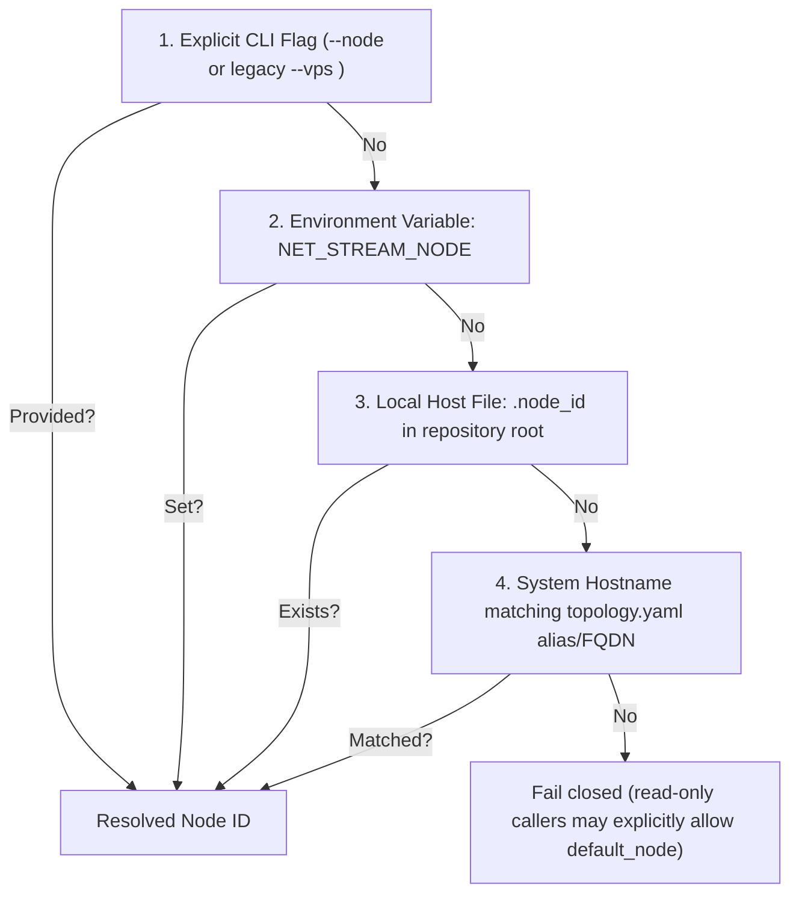

# 1b: Deterministic Node Identity Resolver

> **Sub-Phase:** 1b  
> **Target:** `Scripts/deploy/core/utils.py` & `.node_id` Specification  

---

## 1. Specification: Node Identity Resolution Hierarchy

Every CLI invocation, script run, or background job determines the active Node ID using this strict 4-step hierarchy:



---

## 2. Implementation: `get_active_node_id()` in `utils.py`

Update [`Scripts/deploy/core/utils.py`](Scripts/deploy/core/utils.py):

```python
import os
import socket
from topology import load_topology, get_all_node_ids

NODE_ID_FILE = os.path.join(REPO_ROOT, ".node_id")

def get_active_node_id(cli_arg=None, allow_default=False):
    """Resolve the active Node ID in deterministic hierarchical order.
    
    Priority:
    1. cli_arg (e.g. from --node <id> or --vps <A|B>)
    2. NET_STREAM_NODE environment variable
    3. .node_id file in repository root
    4. Hostname matching against topology.yaml network/fqdn
    5. default_node only when a read-only caller passes allow_default=True
    """
    topology = load_topology()
    valid_nodes = get_all_node_ids()

    # 1. Explicit CLI argument
    if cli_arg:
        normalized = cli_arg.strip().lower()
        # Backward-compatibility bridge: map 'a' -> 'vps-a', 'b' -> 'vps-b'
        if normalized in ("a", "vps-a"):
            return "vps-a"
        if normalized in ("b", "vps-b"):
            return "vps-b"
        if normalized in valid_nodes:
            return normalized
        raise ValueError(f"Invalid node '{cli_arg}'. Must be one of: {valid_nodes}")

    # 2. Environment variable
    env_node = os.environ.get("NET_STREAM_NODE")
    if env_node:
        normalized = env_node.strip().lower()
        if normalized not in valid_nodes:
            raise ValueError("NET_STREAM_NODE names an unknown topology node")
        return normalized

    # 3. Host file (.node_id)
    if os.path.exists(NODE_ID_FILE):
        try:
            with open(NODE_ID_FILE, "r", encoding="utf-8") as f:
                file_node = f.read().strip().lower()
                if file_node in ("a", "vps-a"):
                    return "vps-a"
                if file_node in ("b", "vps-b"):
                    return "vps-b"
                if file_node not in valid_nodes:
                    raise ValueError(".node_id names an unknown topology node")
                return file_node
        except OSError as exc:
            raise RuntimeError("Unable to read .node_id") from exc

    # 4. Hostname inspection
    try:
        hostname = socket.gethostname().lower()
        for node_id, cfg in topology.get("nodes", {}).items():
            aliases = {node_id, *cfg.get("aliases", [])}
            fqdn = cfg.get("tailscale_fqdn", "").lower()
            if hostname in aliases or hostname == fqdn or hostname == fqdn.split(".")[0]:
                return node_id
    except Exception:
        pass

    # 5. Read-only fallback must be requested explicitly.
    if allow_default:
        return topology["default_node"]
    raise RuntimeError("Cannot determine this host's node identity")
```

All mutating commands (`deploy`, `redeploy`, `stop`, `backup`, `restore`, secret
operations, and migration) call the resolver with `allow_default=False`. Read-only
inventory commands may opt into the default only when their output clearly labels the
identity as assumed; `status` and `doctor` should normally report identity as unknown
rather than probing the wrong host.

---

## 3. Host Provisioning Helper (`./manage.py node set <id>`)

Add a helper to `manage.py` to initialize `.node_id` on new hosts:
```bash
./manage.py node set vps-a
# Writes "vps-a" into .node_id and validates against topology.yaml
```

Add `.node_id` to `.gitignore` so host identities are never committed to git.
