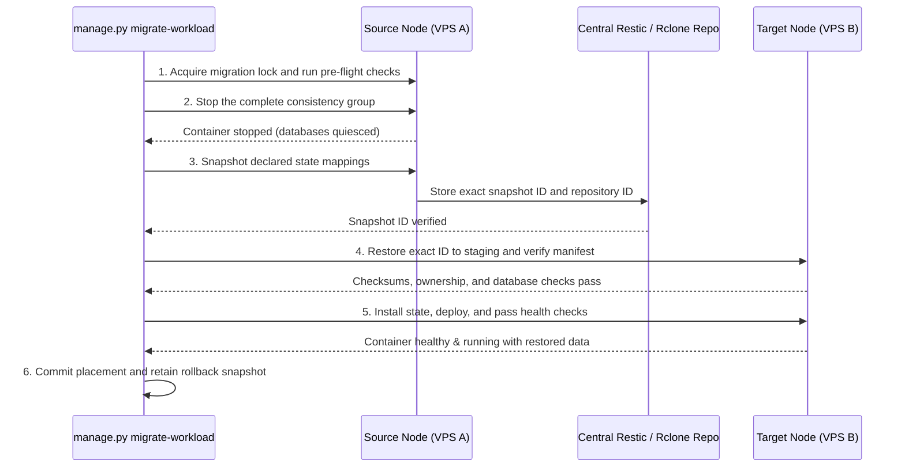

# 3b: Automated State Migration Hook Pipeline

> **Sub-Phase:** 3b  
> **Target:** Stop ➔ Snapshot ➔ Push ➔ Restore ➔ Start Automation  

---

## 1. Objective

Provide a robust CLI utility (`./manage.py migrate-workload`) that coordinates the safe, transactional transfer of container application data across nodes without data corruption or blank container state.

---

## 2. Transactional Migration Pipeline



---

## 3. Implementation: CLI Migration Script

```bash
# Example invocation:
./manage.py migrate-workload jellyfin --from vps-a --to vps-b --yes
```

### Preconditions and transport

* Remote execution is SSH over the Tailscale mesh with strict host-key verification,
  a dedicated least-privilege account, an allow-listed helper, timeouts, and commands
  passed as argument arrays. Arbitrary shell strings are not accepted.
* `./manage.py doctor --cluster-transport` verifies name resolution, host keys, SSH
  authentication, helper version, target free space, source/target Restic access, and
  clock skew before migration.
* A pre-flight compares **key names and required equality only** between the source and
  target Doppler projects without displaying values. Missing or mismatched required keys
  block migration; synchronization remains an explicit operator action in Doppler.
* The source placement, target placement change, namespace co-location, target path
  emptiness, and absence of another active instance are validated before any stop.

### Script Execution Logic (`Scripts/utils/migrate_workload.py`):
```python
def migrate_service(service_name, source_node, target_node, auto_confirm=False):
    journal = preflight_and_lock(service_name, source_node, target_node)
    source_stopped = False
    target_started = False
    try:
        stop_consistency_group(journal)
        source_stopped = True
        snapshot = backup_exact_state(journal)  # exact repository + snapshot IDs
        verify_snapshot(snapshot)
        restore_to_target_staging(snapshot, journal.state_mappings)
        verify_restore_manifest(snapshot, journal.state_mappings)
        snapshot_existing_target_state(journal)
        install_target_state_atomically(journal)
        deploy_target(journal)
        target_started = True
        require_healthy_for(journal, seconds=120)
        commit_placement(journal)
    except Exception:
        if target_started:
            stop_target(journal)
        restore_previous_target_state(journal)
        if source_stopped:
            start_source_and_verify(journal)
        mark_rolled_back(journal)
        raise
    finally:
        release_lock(journal)
```

The journal is append-only and contains no secret values. A process interruption is
resumed or rolled back from its last durable stage. The source state and exact snapshot
are retained for a configured acceptance window; cleanup is a separate confirmed step.

---

## 4. Verification Criteria
* Migrating a test service transfers all database entries and configurations completely.
* Every injected failure after source shutdown stops/cleans the target, restores any
  pre-existing target state, restarts the source, and verifies source health.
* The test matrix covers process interruption at every journal stage, target health
  timeout, Restic copy failure, missing Doppler keys, checksum/ownership mismatch,
  database consistency failure, and concurrent migration lock contention.
