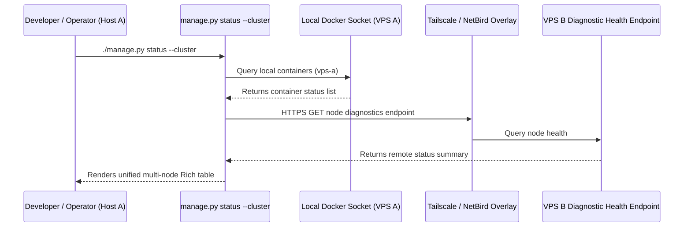

# 4c: Mesh Diagnostics & Cross-Node Healthchecks

> **Sub-Phase:** 4c  
> **Target:** Tailscale/NetBird Cross-Node Status Probing for `--cluster`  

---

## 1. Objective

Enable `./manage.py status --cluster` and `./manage.py doctor --cluster` to query remote nodes over the Tailscale/NetBird overlay mesh network to render a unified cluster status view.

---

## 2. Architecture & Probing Strategy



---

## 3. Managed Diagnostic Agent

Implement a versioned, read-only diagnostic agent as a pinned container in each node's
topology-designated core stack. The agent queries a Docker socket proxy restricted to
read-only container/list/inspect/health endpoints; it never receives the raw Docker
socket and exposes no mutation route. Caddy publishes only `/api/v1/health` on the
node's mesh FQDN.

The endpoint requires HTTPS plus a scoped bearer credential injected from Doppler (or
mesh mTLS when available), uses constant-time credential comparison, rate limits
requests, caps response size, and never logs authorization headers. Tailnet ACLs allow
only operator nodes. Responses contain a schema version, configured node ID, agent
version, observation timestamp, and topology-scoped service summaries; they contain no
environment variables, mount sources, labels with secret material, or host paths.

Add the agent, Docker socket proxy, Caddy route, healthcheck, topology diagnostic URL,
and lifecycle/upgrade procedure to the implementation deliverables. `manage.py validate`
must reject a node without a diagnostic placement or an endpoint whose FQDN does not
match the node record.

## 4. Implementation: Remote Health Probe

In [`Scripts/deploy/core/status.py`](Scripts/deploy/core/status.py):

```python
import httpx

def probe_remote_node(node_id):
    """Query health status of a remote node over Tailscale."""
    topology = load_topology()
    node_cfg = topology.get("nodes", {}).get(node_id, {})
    endpoint = node_cfg.get("diagnostics", {}).get("url")
    
    if not endpoint:
        return {"state": "unknown", "status": "unconfigured"}

    try:
        response = httpx.get(
            endpoint,
            headers=diagnostic_auth_headers(),
            timeout=httpx.Timeout(3.0),
            follow_redirects=False,
        )
        response.raise_for_status()
        payload = validate_bounded_health_response(response, expected_node=node_id)
        return payload
    except httpx.TimeoutException:
        return {"state": "unknown", "status": "timeout"}
    except Exception as exc:
        return sanitized_probe_error(exc)

    return {"state": "unknown"}
```

---

Remote probes run concurrently with a bounded worker count and a total deadline. The
CLI distinguishes `unconfigured`, `unauthorized`, `unreachable`, `stale`, and observed
runtime states; it never translates a failed probe into `exited`.

## 5. Verification Criteria
* `./manage.py status --cluster` renders tables grouped by `Node: vps-a` and `Node: vps-b`.
* Remote node connection timeouts are handled gracefully without crashing the CLI.
* Tests cover invalid credentials, wrong node identity, stale/replayed timestamps,
  malformed/oversized JSON, TLS failure, partial cluster outage, redaction, and bounded
  total latency.
