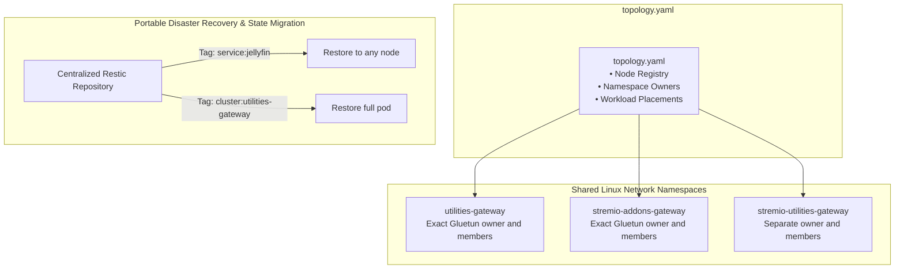
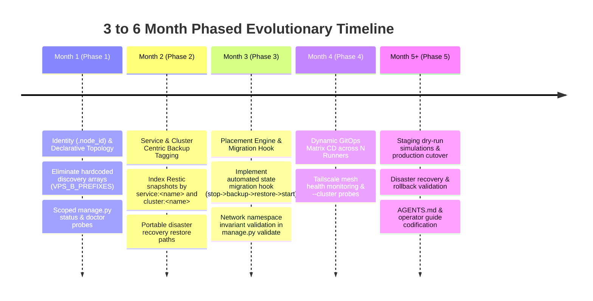

# Idempotent Multi-Node Cluster Architecture & Long-Term Evolutionary Plan

> **Status:** Revised Proposal — Validation Required Before Implementation
> **Horizon:** 3–6 Month Gradual Evolution  
> **Authors:** Antigravity & Louis Bertrand Ntwali  
> **Date:** August 16, 2026  

---

## 1. Executive Summary & Vision

Net-Stream is evolving from a rigid, hardcoded dual-VPS model (`VPS A` and `VPS B`) into a **flexible, idempotent multi-node cluster architecture**.

Rather than performing risky physical directory moves, the architecture cleanly separates:
1. **Logical / Functional Domain Organization on Disk:** Workloads remain organized by domain (`Media/local-media/`, `Media/stremio/`, `Utilities/auth/`, `Network/`).
2. **Declarative Control Plane in `topology.yaml`:** A central manifest separately
   records physical placement, real shared Linux network namespaces, mesh endpoints,
   state mappings, and Doppler projects.
3. **Dual-Level Placement Model:** Supports moving a complete namespace consistency
   group or relocating an individual service with explicit network rebinding.
4. **Service & Cluster-Centric Backups:** Restic snapshots are indexed by stable service
   and namespace IDs, while migrations record an exact repository/snapshot ID and verify
   declared state mappings before cutover.

---

## 2. Target Architecture Overview



---

## 3. Directory Structure of the Plan Suite

```
Docs/plans/idempotent-multi-node/
├── README.md                                          # Master Summary (This document)
│
├── 01-phase-1-foundation-and-identity/                # Phase 1: Foundation & Identity Primitives
│   ├── 00-overview.md                                 # Phase 1 Summary & Definition of Done
│   ├── 1a-topology-manifest-spec.md                   # Nested topology.yaml (Nodes, Gateways, Services)
│   ├── 1b-node-identity-resolver.md                   # get_active_node_id() & .node_id resolution hierarchy
│   ├── 1c-dynamic-discovery-refactoring.md            # discovery.py rewrite based on declarative topology
│   └── 1d-unit-tests-and-validation.md                # Test suite & test assertions for Phase 1
│
├── 02-phase-2-cli-diagnostics-and-backups/            # Phase 2: CLI, Diagnostics & Portable Backups
│   ├── 00-overview.md                                 # Phase 2 Summary & Definition of Done
│   ├── 2a-manage-py-cli-refactoring.md                # --node flag parsing & backward-compatible aliases
│   ├── 2b-status-and-doctor-scoping.md                # Node-scoped inspection, --cluster flag, healthchecks
│   ├── 2c-tui-control-center-updates.md               # Node selector, dashboard rendering, shortcut updates
│   ├── 2d-restic-backup-pipeline-updates.md           # Service & Cluster level Restic tagging strategy
│   └── 2e-snapshot-manager-node-support.md            # SOPS snapshot fallback namespacing for arbitrary nodes
│
├── 03-phase-3-placement-and-migration-runbook/        # Phase 3: Placements & Volume Migration Engine
│   ├── 00-overview.md                                 # Phase 3 Summary & Definition of Done
│   ├── 3a-cluster-and-service-placements.md           # Dual-level placement modeling & network rebinding rules
│   ├── 3b-state-migration-hook-pipeline.md            # Stop -> Snapshot -> Push -> Restore -> Start automation
│   └── 3c-namespace-invariants-and-validation.md      # Co-location & 127.0.0.1 port validation in manage.py
│
├── 04-phase-4-gitops-matrix-and-mesh/                 # Phase 4: GitOps Matrix & Mesh Observability
│   ├── 00-overview.md                                 # Phase 4 Summary & Definition of Done
│   ├── 4a-github-actions-matrix-deployment.md         # deploy.yml dynamic matrix detection & deployment job
│   ├── 4b-self-hosted-runner-federation.md            # Runner labels, environment secrets, and provisioning
│   └── 4c-mesh-diagnostics-and-healthchecks.md        # Cross-node status inspection over Tailscale/NetBird
│
└── 05-phase-5-verification-and-cutover/               # Phase 5: Verification, Cutover & Docs
    ├── 00-overview.md                                 # Phase 5 Summary & Definition of Done
    ├── 5a-staging-and-dry-run-runbook.md              # Pre-cutover dry run procedures & smoke testing
    ├── 5b-production-cutover-checklist.md             # Live production deployment execution steps
    ├── 5c-rollback-and-disaster-recovery-plan.md      # Emergency rollback procedures and state recovery
    └── 5d-developer-and-ops-guide.md                  # Updated AGENTS.md, README.md, and operator guide
```

---

## 4. Phase-by-Phase Detailed Breakdown

### Phase 1: Foundation & Identity Primitives (Month 1)
* **Goal:** Establish identity and central manifest without altering live containers.
* **Key Deliverables:** `topology.yaml` specification, `get_active_node_id()` hierarchical resolver, refactored `discovery.py`, and comprehensive unit tests.
* **Exit Criteria:** `./manage.py node current` works; every active Compose project under
  the declared roots resolves exactly once, with no fixed-count assumption.

### Phase 2: CLI, Diagnostics & Portable Backups (Month 2)
* **Goal:** Scope CLI tools to the local node and decouple backups from host names.
* **Key Deliverables:** `--node` flag in `manage.py`, node-scoped `./manage.py status` & `./manage.py doctor`, TUI node selector (`[N]`), exact-ID Restic records with declared state mappings, and dynamic `SnapshotManager`.
* **Exit Criteria:** `./manage.py status` on VPS A reports only VPS A services (zero false "Stopped" alerts); backups indexed by service and cluster.

### Phase 3: Placements & Automated State Migration Engine (Month 3)
* **Goal:** Enable declarative service moves and automated volume migration between nodes.
* **Key Deliverables:** Dual-level placement modeling, durable transactional migration
  with source recovery, and namespace/state/port validation in `manage.py validate`.
* **Exit Criteria:** A service can be migrated between nodes via a single command with automated state snapshotting and restoration.

### Phase 4: GitOps Matrix & Mesh Observability (Month 4)
* **Goal:** Auto-scale CI/CD deployments and enable cross-node mesh health monitoring.
* **Key Deliverables:** Topology-driven matrix detection that preserves production sync
  safeguards, standardized runner labels, and authenticated read-only diagnostic agents.
* **Exit Criteria:** Pushing changes to a specific stack deploys only to that stack's assigned runner; `--cluster` renders a unified multi-node dashboard.

### Phase 5: Verification, Production Cutover & Documentation (Month 5+)
* **Goal:** Rehearse failure recovery, execute cutover within an approved maintenance
  window, verify disaster recovery, and complete operator documentation.
* **Key Deliverables:**
  1. **Staging & Dry-Run Runbook ([`5a-staging-and-dry-run-runbook.md`](./05-phase-5-verification-and-cutover/5a-staging-and-dry-run-runbook.md)):** Non-destructive pre-flight simulations verifying Doppler secret resolution, compose validation, and status inspection across all nodes.
  2. **Production Cutover Execution ([`5b-production-cutover-checklist.md`](./05-phase-5-verification-and-cutover/5b-production-cutover-checklist.md)):** Step-by-step production promotion checklist, live container verification, and end-to-end ingress/DNS health testing.
  3. **Rollback & Disaster Recovery Runbook ([`5c-rollback-and-disaster-recovery-plan.md`](./05-phase-5-verification-and-cutover/5c-rollback-and-disaster-recovery-plan.md)):** Separate control-plane reversal, exact-snapshot data recovery, reverse migration, and tested encrypted-secret recovery.
  4. **Developer & Operator Standards ([`5d-developer-and-ops-guide.md`](./05-phase-5-verification-and-cutover/5d-developer-and-ops-guide.md)):** Updated `AGENTS.md`, `README.md`, `Docs/NETWORK_ARCHITECTURE.md`, and the New Node Provisioning Checklist.
* **Exit Criteria:** Production cluster running 100% healthy under the new architecture; disaster recovery tests verified; all developer docs updated.

---

## 5. Multi-Month Evolutionary Timeline


